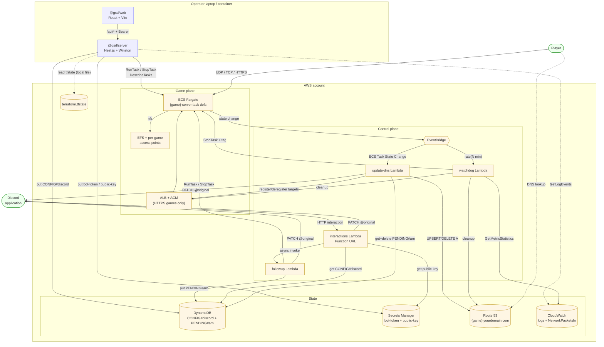
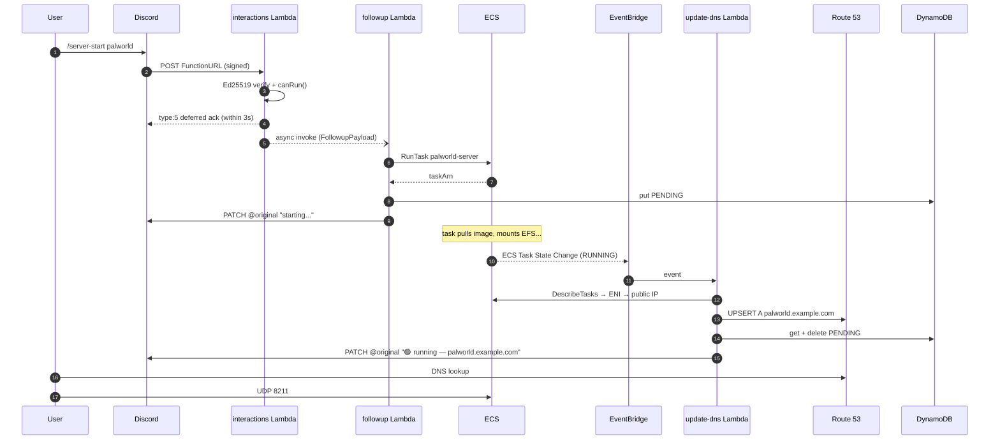

# Architecture

Three loosely-coupled pieces, all sharing types and helpers through a single
workspace package, `@gsd/shared`:

1. **Terraform** provisions every AWS resource.
2. The **management app** (Nest.js API + React dashboard) is a local control
   plane. It reads `terraform.tfstate` directly to discover what the infra
   looks like and drives AWS via SDK v3.
3. Four **Lambdas** run the always-on control flow: two for Discord, one for
   DNS, one for the idle watchdog.

There is **no persistent ECS service**. Game servers only exist while a
RunTask is in flight — Start triggers `ecs.runTask`, Stop triggers
`ecs.stopTask`, and the Watchdog Lambda stops tasks that look idle.

## Component diagram

## The `/server-start` critical path

When a user types `/server-start palworld` in Discord, five AWS services and
three Lambdas cooperate to return a usable `palworld.yourdomain.com` without
ever letting the interaction time out.

After the session: either the user types `/server-stop palworld` (same flow
but `stopTask` + `DELETE` A record), or the Watchdog Lambda notices
`NetworkPacketsIn < min_packets` for four consecutive 15-minute windows and
stops the task itself.

## Invariants

These are easy to break by accident. They are spelled out in `CLAUDE.md`, the
maintainer guide, and inline in a few Terraform files. If you change one,
write the PR description as if you're explaining the new design.

1. **`game_servers` in `terraform.tfvars` is the single source of truth.**
   Task definitions, EFS access points, log groups, security-group rules, and
   the `GAME_NAMES` env var on three Lambdas are all produced by `for_each`
   over this map. Adding or removing a game means editing exactly one place.

2. **DNS is Lambda-managed, not Terraform-managed.** The Route 53 zone is
   a data source; individual A records are created and deleted by the
   update-dns Lambda in response to ECS task state changes. Adding an
   `aws_route53_record` resource would fight the Lambda.

3. **Lambdas use `AWS_REGION_` (trailing underscore).** The standard
   `AWS_REGION` name is reserved by the Lambda runtime and cannot be
   overridden. Every Lambda reads `process.env.AWS_REGION_` instead.

4. **Secrets never leave AWS.** The bot token and the Discord public key
   live in Secrets Manager. The management app can write them and
   `getEffectiveToken()` once (to register guild commands), but they are
   never sent to the browser — the API only returns `botTokenSet` /
   `publicKeySet` booleans.

5. **Per-guild command registration only.** `DiscordCommandRegistrar.registerForGuild`
   PUTs to `applications/{client_id}/guilds/{guild_id}/commands`. Do not
   register global commands — they would leak to every guild the bot is
   invited to.

6. **Permission resolution lives in `canRun()` in `@gsd/shared`.** The server
   and both Discord Lambdas import the same function. Do not duplicate the
   logic; do not reorder the checks (guild allowlist → admin → per-game).

7. **Watchdog state lives in ECS task tags.** There is no DynamoDB/SSM for
   the idle counter — it is an `idle_checks` tag on each running task.
   Counter resets when a task stops, which is free.

See the [maintainer guide]({{ '/guides/maintainer/' | relative_url }}) for
what tends to break these and what the failure modes look like.
