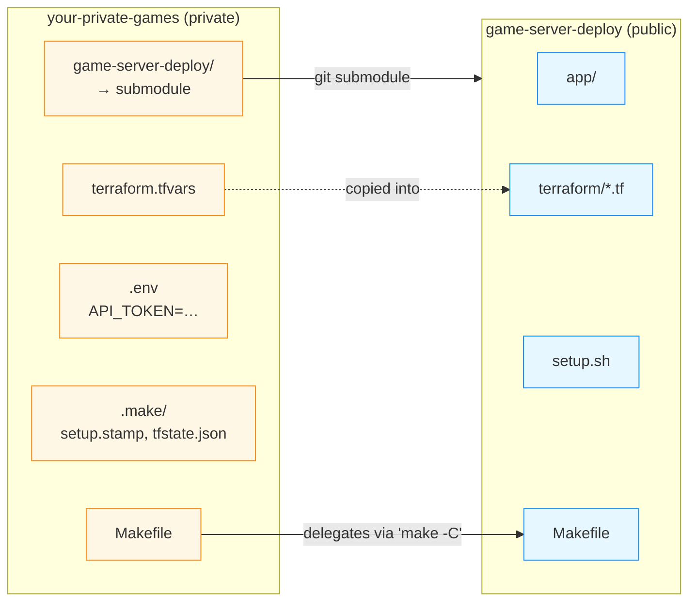

# Private parent repo + submodule

This is the pattern we recommend if you're running the stack for real: a
**private parent repo** you own, with this repo vendored as a git submodule,
plus all the per-deployment secrets sitting alongside. Nothing sensitive ever
lives in a public fork, and pulling upstream changes is one `make update`
away.

If you're just kicking the tyres, the plain
[setup guide](/setup) is fine. Come back to this
page when you're ready to commit your config to source control.

## Why this layout

`terraform.tfvars` (with your hosted zone, and optionally Discord
credentials), `terraform.tfstate` (raw infrastructure state including IAM
role names and the DNS zone ID), and `API_TOKEN` for the management app
are **yours**. None of them belong in this public repo. A submodule keeps
upstream code cleanly separated from your deployment-specific configuration
without forking.



The parent's wrapper Makefile copies `terraform.tfvars` into the submodule on
every plan/apply, then delegates Terraform/dev work to the submodule's own
`Makefile` targets (`tf-plan`, `tf-apply`, `dev`, …). The submodule checkout
stays clean — only files inside its own `.gitignore` get touched.

## Reference layout

```text
your-private-games/                 # private repo you own
├── .gitmodules
├── .gitignore                      # ignores .env, .make/, *.tfstate
├── .env                            # API_TOKEN — gitignored
├── Makefile                        # wrapper — see "What the wrapper does" below
├── terraform.tfvars                # YOUR copy; checked in (private repo)
├── .make/                          # stamp dir (sha of submodule setup.sh, cached tfstate)
└── game-server-deploy/             # submodule → CoderCoco/game-server-deploy
```

That's the whole shape. No `config/` directory, no symlinks, no
`docker-compose.override.yml`. Everything driven from one Makefile.

## Quick start (interactive scaffolder)

The public repo ships an interactive TypeScript script that writes the four
files above for you. It only needs Node.js 20+, which you already need for
the rest of the project.

```bash
# 1. Create a private repo on GitHub, then clone it.
git clone git@github.com:you/your-private-games.git
cd your-private-games

# 2. Add the submodule.
git submodule add https://github.com/CoderCoco/game-server-deploy.git

# 3. Install all deps and run the scaffolder.
(cd game-server-deploy && npm install)
(cd game-server-deploy && npm run scripts:init-parent)
```

The script prompts for project name, AWS region, hosted zone, and
(optionally) Discord credentials, then writes `Makefile`,
`terraform.tfvars`, `.env`, and `.gitignore`. Existing files are skipped
unless you pass `--force`.

After it finishes:

```bash
$EDITOR terraform.tfvars            # add at least one entry under game_servers
make setup                          # init submodule, run setup.sh, terraform init
make plan
make apply
```

## What the wrapper Makefile does

The generated wrapper is a thin layer over the submodule's own Makefile.
Five targets, no surprises:

| Target | What it does |
|---|---|
| `make setup` | One-time bootstrap. Runs `git submodule update --init --recursive`, executes `game-server-deploy/setup.sh` (installs Node/Terraform/AWS CLI on Debian/Ubuntu, npm-installs all workspaces, builds Lambda bundles, runs `terraform init` and bootstraps the S3 backend), then records the sha256 of `setup.sh` in `.make/setup.stamp`. |
| `make plan` | Copies `terraform.tfvars` into `game-server-deploy/terraform/terraform.tfvars`, then runs `make -C game-server-deploy tf-plan` — which itself rebuilds the Lambda bundles before `terraform plan`. |
| `make apply` | Same as `plan`, but delegates to `tf-apply`. The submodule's `tf-apply` recipe prints a post-deploy checklist with the Discord interactions URL when it finishes. |
| `make update` | Bumps the submodule to the tip of `main` (`git submodule update --remote --merge`). If the new `setup.sh` differs from the recorded sha, clears `.terraform/` and re-runs `setup.sh` automatically; otherwise leaves it alone. Reminds you to commit the new submodule pointer. |
| `make dev` | Pulls live tfstate into `.make/tfstate.json` (so the embed step has something to read), wipes stale TS build info under the submodule's `app/packages/*/`, then runs `make -C game-server-deploy dev`, exporting `API_TOKEN` and `TF_STATE_PATH` to the child make. |

The `tfvars` copy is **always fresh** on plan/apply — the recipe `cp`s
unconditionally, not just when the file is older than the destination. This
prevents stale variables from sneaking into a deploy when you've edited the
parent's `terraform.tfvars` between runs.

## Submodule update with idempotent setup.sh re-run

`make update` records `sha256sum game-server-deploy/setup.sh` in
`.make/setup.stamp` after each successful setup. On every subsequent
`update`, it compares the new file's sha against the stamp:

- **Unchanged** → nothing to do; the existing `.terraform/` and installed
  npm dependencies are still valid.
- **Changed** → upstream tweaked the bootstrap (new tool version, S3 backend
  config change, Lambda build step, …). The recipe wipes
  `game-server-deploy/terraform/.terraform/` and re-runs `setup.sh`, then
  records the new sha.

You don't have to remember whether the bootstrap moved. The stamp file is
cheap and gitignored.

## .env and the API_TOKEN

`API_TOKEN` is the bearer token the management app's Nest server requires
on every `/api/*` request. The wrapper Makefile loads it from `.env` via
`include`, so it's available for `make dev` and any docker-compose target
without ever being baked into the Makefile itself:

```makefile
ifneq (,$(wildcard $(REPO_ROOT)/.env))
include $(REPO_ROOT)/.env
export
endif
```

`.env` is in the parent's `.gitignore`. Generate a fresh token with
`openssl rand -hex 32` (or just re-run `init-parent.ts`) — there's no need
to keep the same token across rebuilds.

## tfstate lives in S3 by default

`game-server-deploy/setup.sh` provisions an S3 bucket
(`{project_name}-tf-state`) and a DynamoDB lock table
(`{project_name}-tf-locks`) on first run, then `terraform init`s with the
S3 backend pointing at them. The parent repo never holds `terraform.tfstate`
on disk — the wrapper's `make dev` pulls a fresh copy into
`.make/tfstate.json` for the management app to read.

If you don't want a remote backend (single-operator, throwaway deployment),
delete the S3 bootstrap from your fork of `setup.sh`. We don't recommend
this for anything you care about.

## Discord credentials: pick a home

There are three reasonable places for the Application ID, Bot Token, and
Public Key. Trade-offs:

| Location | Pros | Cons |
|---|---|---|
| **tfvars in the private parent** | One source of truth; `terraform apply` seeds them. Rotation via `terraform taint`. | They're on disk wherever the parent repo is cloned. |
| **Environment at apply time** (`TF_VAR_discord_bot_token=…`) | Never on disk. | Every operator needs the token in their shell to apply. |
| **Dashboard only** | Token only exists in Secrets Manager. | You have to paste it once per fresh environment, and the DDB `CONFIG#discord` row is seeded manually. |

The tfvars route is what most people pick, and it's what `init-parent.ts`
will offer to seed. Your parent repo is private, so it ends up covered by
the same "private-repo trust boundary" as everything else.

Rotation after the first apply (tfvars route):

```bash
terraform taint aws_secretsmanager_secret_version.discord_bot_token
# or: aws_secretsmanager_secret_version.discord_public_key
# or: aws_dynamodb_table_item.discord_config_seed
make apply
```

## Keeping up with upstream

```bash
make update
git add game-server-deploy
git commit -m "chore: bump game-server-deploy to $(git -C game-server-deploy rev-parse --short HEAD)"
make plan        # eyeball the diff
make apply       # if it looks right
```

`make update` always reminds you about the commit step at the end. If
`setup.sh` changed upstream, it'll have already re-run by the time `make
plan` starts, so the next plan picks up any new tooling cleanly.

Things that tend to need attention after a bump:

- New or renamed Terraform variables → add them to your
  `terraform.tfvars`. Compare against
  `game-server-deploy/terraform/terraform.tfvars.example`.
- New environment variables on the Lambdas → typically Terraform handles
  this automatically, but verify in the plan output.
- Changes to the four slash-command descriptors → re-click **Register
  commands** in the dashboard so Discord picks them up per guild.

## CI in the parent repo (optional)

A useful GitHub Actions pattern if you want automated drift detection:

```yaml
# .github/workflows/plan.yml in the parent repo
name: terraform plan
on:
  pull_request:
  schedule:
    - cron: "0 9 * * 1"       # Monday 09:00 UTC drift check

jobs:
  plan:
    runs-on: ubuntu-latest
    steps:
      - uses: actions/checkout@v4
        with:
          submodules: recursive
      - uses: aws-actions/configure-aws-credentials@v4
        with:
          role-to-assume: ${{ secrets.AWS_ROLE_ARN }}
          aws-region: us-east-1
      - uses: hashicorp/setup-terraform@v3
      - uses: actions/setup-node@v4
        with:
          node-version: 20
      - run: make setup
      - run: make plan
```

Use OIDC → an IAM role for `aws-actions/configure-aws-credentials` rather
than stashing long-lived keys. The role's policy is the same
`GameServerDeployAll` inline policy from the [setup guide](/setup).

## What NOT to do

- **Don't fork the public repo and edit it.** The submodule pattern gives
  you every pinning benefit of a fork without the merge conflicts. If you
  need a real code change, contribute upstream and `make update` to bump
  to the new commit.
- **Don't commit `terraform.tfvars` inside the submodule.** Even a private
  parent doesn't save you if someone later runs `git submodule foreach git
  push origin HEAD`. Keep your tfvars in the *parent* — the wrapper copies
  it into the submodule at apply time, and the submodule's own
  `.gitignore` excludes `terraform/*.tfvars`.
- **Don't hardcode `API_TOKEN` in the wrapper Makefile.** Use `.env` and
  the `include`/`export` pattern. The Makefile lives in your private repo,
  but a leaked clone is one careless `git push` away.
- **Don't run plan/apply directly in the submodule.** Always go through
  the parent's `make plan`/`make apply` so the freshly-edited
  `terraform.tfvars` is copied in first. A plan against stale vars is a
  plan against the wrong universe.

## Troubleshooting

| Symptom | Cause | Fix |
|---|---|---|
| `make plan` says "No such file or directory" pointing at `game-server-deploy/` | Submodule wasn't initialised | `make setup` (or `git submodule update --init --recursive`). |
| `make apply` runs against an old `terraform.tfvars` | You edited the parent's tfvars but ran terraform inside the submodule directly | Always run `make apply` from the parent — the `copy-tfvars` recipe forces a fresh copy. |
| `make update` silently pulls main and breaks apply | Upstream changed something incompatible | The stamp file's job is to flag setup.sh changes; for non-bootstrap breakage, run `make plan` and read the diff. Pin to a SHA in `.gitmodules` if you want stricter control. |
| After bumping upstream, Discord commands have wrong arguments | Descriptors in `@gsd/shared/commands.ts` changed | Click **Register commands** for each guild in the dashboard. |
| `make dev` complains it can't read tfstate | First-time run before `make apply` | Ignore — the recipe writes `null` and the app degrades gracefully until the first apply succeeds. |
| CI plan shows a Lambda recreating every run | Bundle hash changes between builds | Run `npm ci` (not `npm install`) in CI to pin dependencies; `setup.sh` already does this. |
