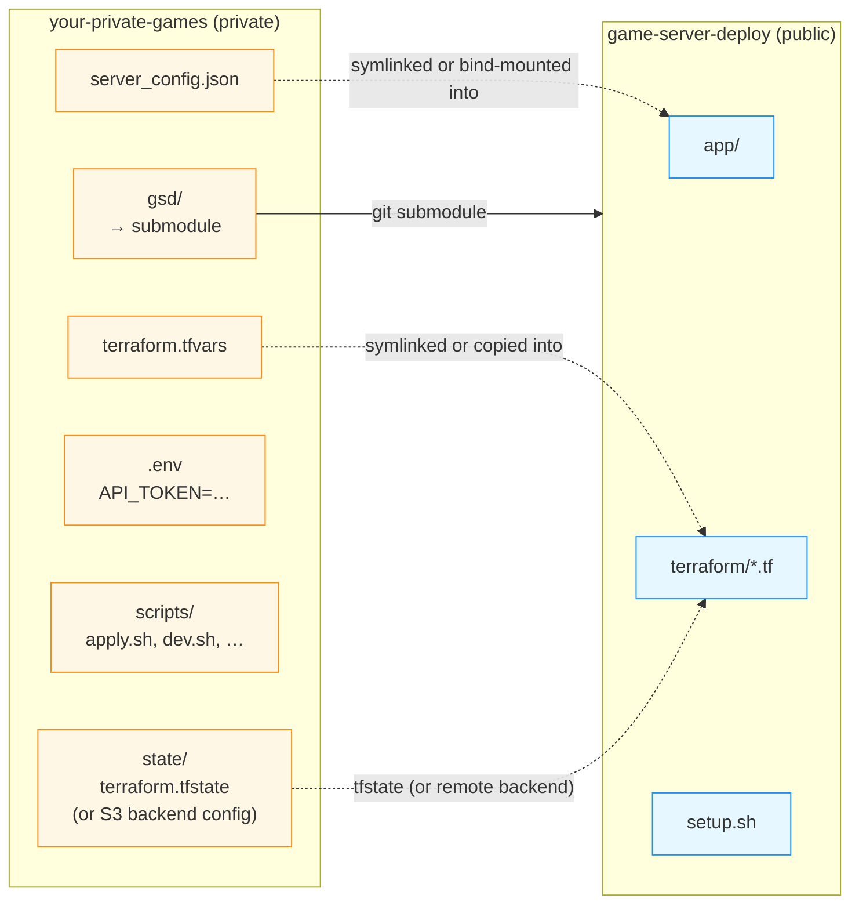

# Private parent repo + submodule

This is the pattern we recommend if you're running the stack for real: a
**private parent repo** you own, with this repo vendored as a git submodule,
plus all the per-deployment secrets sitting alongside. Nothing sensitive ever
lives in a public fork, and pulling upstream changes is `git submodule update
--remote`.

If you're just kicking the tyres, the plain
[setup guide]({{ '/setup/' | relative_url }}) is fine. Come back to this
page when you're ready to commit your config to source control.

## Why this layout

`terraform.tfvars` (with your hosted zone, and optionally Discord
credentials), `server_config.json` (watchdog knobs and the bearer token),
and `terraform.tfstate` (raw infrastructure state including IAM role
names and the DNS zone ID) are **yours**. None of them belong in this
public repo. A submodule keeps upstream code cleanly separated from your
deployment-specific configuration without forking.



The secret-bearing files stay in the parent; the submodule stays
upstream-clean.

## Reference layout

```text
your-private-games/                 # private repo you own
├── .gitmodules
├── .gitignore                      # ignores state/, .env, secrets/
├── .env                            # API_TOKEN, AWS_PROFILE, etc. — gitignored
├── README.md                       # your personal runbook
├── gsd/                            # submodule → codercoco/game-server-deploy
├── config/
│   ├── terraform.tfvars            # YOUR copy; checked in
│   └── server_config.json          # checked in (minus api_token)
├── state/                          # tfstate if using local backend
│   └── terraform.tfstate           # gitignored
├── docker-compose.override.yml     # optional — custom mounts
└── scripts/
    ├── setup.sh                    # wrapper around gsd/setup.sh
    ├── apply.sh
    └── dev.sh
```

## Step by step

### 1. Create the private repo

```bash
# On GitHub, create `your-private-games` (or whatever) as a private repo.
git clone git@github.com:you/your-private-games.git
cd your-private-games
```

### 2. Add the submodule

```bash
git submodule add https://github.com/codercoco/game-server-deploy.git gsd

# Pin to a known-good commit (recommended):
cd gsd && git checkout <sha-or-tag> && cd ..
git add .gitmodules gsd
git commit -m "chore: pin gsd submodule"
```

Using a pinned SHA/tag means upstream changes don't silently affect your
next apply; you update explicitly with:

```bash
cd gsd && git fetch && git checkout <new-sha> && cd ..
git add gsd && git commit -m "chore: bump gsd to <new-sha>"
```

### 3. `.gitignore` the things that must never leak

```gitignore
# Local tfstate (if you don't use a remote backend)
state/*.tfstate
state/*.tfstate.backup
state/.terraform/
state/.terraform.lock.hcl

# Shell env with the bearer token and sometimes AWS creds
.env

# Anything you keep outside config/ that's sensitive
secrets/

# Editor / OS noise
.DS_Store
.vscode/
```

### 4. Put your tfvars and server config in `config/`

```bash
mkdir -p config state
cp gsd/terraform/terraform.tfvars.example config/terraform.tfvars
# edit config/terraform.tfvars with your real values

cat > config/server_config.json <<'JSON'
{
  "watchdog_interval_minutes": 15,
  "watchdog_idle_checks": 4,
  "watchdog_min_packets": 100
}
JSON
```

Now wire those into the submodule's expected paths. Two options:

- **Symlinks** (simplest, works on Linux + macOS):

  ```bash
  ln -sf "$(pwd)/config/terraform.tfvars" gsd/terraform/terraform.tfvars
  ln -sf "$(pwd)/config/server_config.json" gsd/app/server_config.json
  ```

  Both paths are gitignored inside `gsd/`, so the symlinks won't pollute the
  submodule's working tree.

- **Script-driven copies** (works on Windows, or if you dislike symlinks):
  have `scripts/apply.sh` copy `config/*` into `gsd/terraform/` and
  `gsd/app/` at the start of every run. The copy target is already
  gitignored inside the submodule.

### 5. Decide where tfstate lives

Two reasonable choices:

- **Local state in the parent repo** — simplest, fine for a single
  operator. Add a backend override file inside the symlinked tfvars or
  point `terraform init` at an explicit `-chdir` pattern:

  ```bash
  terraform -chdir=gsd/terraform init \
    -backend-config="path=$(pwd)/state/terraform.tfstate"
  ```

- **S3 + DynamoDB remote backend** — better for teams, CI, or "don't
  lose your laptop". Add a `backend.tf` in `config/` with:

  ```hcl
  terraform {
    backend "s3" {
      bucket         = "your-tf-state-bucket"
      key            = "gsd/terraform.tfstate"
      region         = "us-east-1"
      dynamodb_table = "tf-state-lock"
      encrypt        = true
    }
  }
  ```

  and symlink it into `gsd/terraform/backend.tf`. The bucket and lock
  table need to be created once, either by hand or by a tiny bootstrap
  terraform in its own directory.

### 6. Put the bearer token in `.env`

`app/server_config.json` can hold an `api_token` field, but if your
`server_config.json` is committed to the parent repo you don't want the
token in there. Put it in `.env` instead (gitignored):

```bash
# .env
export API_TOKEN="$(openssl rand -hex 32)"
export AWS_PROFILE="games"    # if you use named profiles
```

Source it before running anything:

```bash
source .env
cd gsd/app && npm run dev
# or
cd gsd && docker compose up --build
```

`server_config.json` stays token-free and public to whoever reads the
private parent; the actual secret comes from the environment at runtime.

### 7. Write a thin wrapper script

A minimal `scripts/apply.sh`:

```bash
#!/usr/bin/env bash
set -euo pipefail
cd "$(dirname "$0")/.."

# Ensure submodule is at the committed SHA
git submodule update --init --recursive

# (Re)link config into the submodule
ln -sf "$(pwd)/config/terraform.tfvars" gsd/terraform/terraform.tfvars
ln -sf "$(pwd)/config/server_config.json" gsd/app/server_config.json

# Build Lambdas, then apply
cd gsd/app && npm ci && npm run build:lambdas
cd ../terraform && terraform init && terraform apply
```

Similar `dev.sh` for the management app:

```bash
#!/usr/bin/env bash
set -euo pipefail
cd "$(dirname "$0")/.."
source .env
cd gsd/app
npm ci
npm run dev
```

Run `chmod +x scripts/*.sh` and you're one command away from each action.

### 8. Docker: override mounts, don't rewrite the compose file

If you're using `docker compose`, create a `docker-compose.override.yml` in
the parent. Compose merges it with `gsd/docker-compose.yml`:

```yaml
# docker-compose.override.yml — kept in the parent repo
services:
  app:
    volumes:
      - ./config/server_config.json:/app/server_config.json
      - ./state:/app/terraform/state:ro   # if using local tfstate outside gsd/
    env_file:
      - .env
```

Run it from inside the submodule:

```bash
cd gsd
docker compose -f docker-compose.yml -f ../docker-compose.override.yml up --build
```

## Discord credentials: pick a home

There are three reasonable places for the Application ID, Bot Token, and
Public Key. Trade-offs:

| Location | Pros | Cons |
|---|---|---|
| **tfvars in the private parent** | One source of truth; `terraform apply` seeds them. Rotation via `terraform taint`. | They're on disk wherever the parent repo is cloned. |
| **Environment at apply time** (`TF_VAR_discord_bot_token=…`) | Never on disk. | Every operator needs the token in their shell to apply. |
| **Dashboard only** | Token only exists in Secrets Manager. | You have to paste it once per fresh environment, and the DDB `CONFIG#discord` row is seeded manually. |

The tfvars route is what most people pick. `.tfvars` is gitignored in the
*submodule*, and your parent repo is private, so it ends up covered by the
same "private-repo trust boundary" as everything else.

Rotation after the first apply (tfvars route):

```bash
terraform taint aws_secretsmanager_secret_version.discord_bot_token
# or: aws_secretsmanager_secret_version.discord_public_key
# or: aws_dynamodb_table_item.discord_config_seed
terraform apply
```

## Keeping up with upstream

```bash
cd gsd
git fetch
git log --oneline HEAD..origin/main           # preview
git checkout origin/main                      # or a new tag
cd ..
git add gsd && git commit -m "chore: bump gsd to $(git -C gsd rev-parse --short HEAD)"
```

Always run `npm run build:lambdas` + `terraform plan` after a bump and
eyeball the plan diff before applying. Breaking changes in the upstream
Lambda env-var shape or IAM policies will show up as Lambda changes in the
plan.

Things that tend to need attention after a bump:

- New or renamed Terraform variables → add them to your
  `config/terraform.tfvars`.
- New environment variables on the Lambdas → typically Terraform handles
  this automatically, but verify in the plan output.
- Changes to the four slash-command descriptors → re-click **Register
  commands** in the dashboard so Discord picks them up per guild.

## CI in the parent repo (optional)

A useful GitHub Actions pattern if you want automated drift detection:

```yaml
# .github/workflows/plan.yml in the parent repo
name: terraform plan
on:
  pull_request:
  schedule:
    - cron: "0 9 * * 1"       # Monday 09:00 UTC drift check

jobs:
  plan:
    runs-on: ubuntu-latest
    steps:
      - uses: actions/checkout@v4
        with:
          submodules: recursive
      - uses: aws-actions/configure-aws-credentials@v4
        with:
          role-to-assume: ${{ secrets.AWS_ROLE_ARN }}
          aws-region: us-east-1
      - uses: hashicorp/setup-terraform@v3
      - uses: actions/setup-node@v4
        with:
          node-version: 20
      - run: cd gsd/app && npm ci && npm run build:lambdas
      - run: |
          ln -sf "$(pwd)/config/terraform.tfvars" gsd/terraform/terraform.tfvars
          cd gsd/terraform && terraform init && terraform plan -no-color
```

Use OIDC → an IAM role for `aws-actions/configure-aws-credentials` rather
than stashing long-lived keys. The role's policy is the same
`GameServerDeployAll` inline policy from the [setup guide]({{ '/setup/' |
relative_url }}).

## What NOT to do

- **Don't fork the public repo and edit it.** The submodule pattern gives
  you every pinning benefit of a fork without the merge conflicts. If you
  need a real code change, contribute upstream and bump your submodule to
  the new commit.
- **Don't commit `terraform.tfvars` inside the submodule.** Even a private
  parent doesn't save you if someone later runs `git submodule foreach git
  push origin HEAD`. Keep your config in `config/` in the parent and
  symlink it in.
- **Don't commit `terraform.tfstate` anywhere in the public repo path.**
  Keep it in `state/` (gitignored) or in a remote backend.
- **Don't expose `API_TOKEN` in `server_config.json` if that file is
  committed.** Environment variable only, or commit the file without the
  `api_token` field.

## Troubleshooting

| Symptom | Cause | Fix |
|---|---|---|
| `terraform apply` inside the submodule can't find `terraform.tfvars` | Symlink missing or broken | Re-run `scripts/apply.sh` which recreates them, or `ln -sf ../../config/terraform.tfvars gsd/terraform/terraform.tfvars`. |
| `docker compose` ignores your override | Running from the wrong directory | From `gsd/`, pass both files explicitly: `-f docker-compose.yml -f ../docker-compose.override.yml`. |
| `git submodule update --remote` silently pulls main and breaks apply | You hadn't pinned; `remote` moves to origin/HEAD | Either pin to a SHA (`git -C gsd checkout <sha>`) or add `branch = main` in `.gitmodules` and review diffs before every bump. |
| After bumping upstream, Discord commands have wrong arguments | Descriptors in `@gsd/shared/commands.ts` changed | Click **Register commands** for each guild in the dashboard. |
| CI plan shows a Lambda recreating every run | Bundle hash changes between builds | Run `npm ci` (not `npm install`) in CI to pin dependencies; commit `app/package-lock.json` via the submodule bump. |
