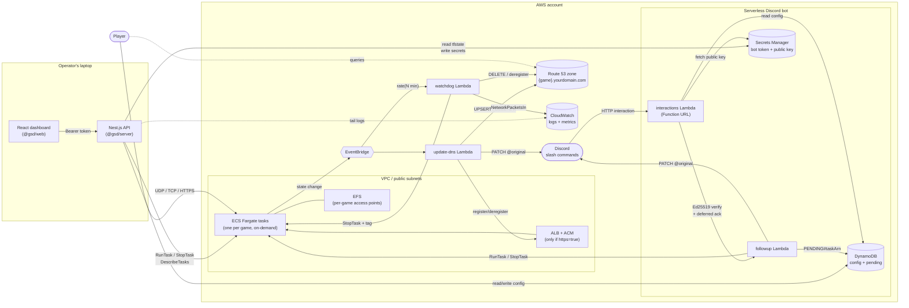

# Game Server Deploy

A cost-efficient, multi-game dedicated server platform on **AWS Fargate** with a
local management UI and a fully serverless Discord bot. Servers only run — and
only cost money — while somebody is playing; the rest of the time the account
is silent except for a handful of near-free Lambdas.

## What you get

- **On-demand Fargate tasks** per game (no persistent ECS service, no idle cost).
- **EFS with per-game access points** so each world is isolated yet persistent.
- **Auto-DNS** — a Lambda UPSERTs `{game}.{yourdomain}` on task start and
  DELETEs it on stop. Optional ALB with ACM for HTTPS-fronted games.
- **Watchdog Lambda** that stops servers after a configurable idle window.
- **Local Nest.js + React dashboard** to start/stop, edit config, stream logs,
  and track costs.
- **Serverless Discord bot** — two Node.js Lambdas plus DynamoDB and Secrets
  Manager handle every slash command; no 24/7 bot process.

## Choose your path

The rest of the site is organised around three roles. Pick the one that
matches what you're doing right now:

- **[Setup guide]({{ '/setup/' | relative_url }})** — from a blank AWS account
  to a running game server, in order.
- **[User guide]({{ '/guides/user/' | relative_url }})** — day-to-day
  operation: starting/stopping servers from the dashboard or Discord, reading
  the cost panel, checking logs.
- **[Maintainer guide]({{ '/guides/maintainer/' | relative_url }})** — working
  on the code: monorepo layout, tests, lint, CI, release/deploy mechanics,
  load-bearing invariants not to break.
- **[Submodule guide]({{ '/guides/submodule/' | relative_url }})** — the
  pattern of wrapping this repo as a git submodule inside a private parent
  repo that holds `terraform.tfvars`, `server_config.json`, state, and
  anything else secret.

## Component reference

Deep-dives on each piece, for when the guides hand-wave past something:

- [Architecture overview]({{ '/architecture/' | relative_url }}) — the diagram
  below in full, with every arrow annotated.
- [Terraform]({{ '/components/terraform/' | relative_url }}) — every `.tf`
  file, variables, outputs, and AWS services touched.
- [Management app]({{ '/components/management-app/' | relative_url }}) — the
  Nest.js API, React dashboard, and `@gsd/shared` library.
- [Lambdas]({{ '/components/lambdas/' | relative_url }}) — the four Node.js
  Lambdas (interactions, followup, update-dns, watchdog).

## High-level architecture



> Run Terraform from your laptop (or a CI runner); after that the control
> plane is the dashboard, the Discord bot, or EventBridge schedules. No
> persistent server process — only the Fargate tasks themselves cost money,
> and only while they're running.

## Repository map

```text
game-server-deploy/
├── app/                       # Nest.js + React monorepo (npm workspaces)
│   └── packages/
│       ├── shared/            # @gsd/shared
│       ├── server/            # @gsd/server (Nest.js API)
│       ├── web/               # @gsd/web   (React + Vite)
│       └── lambda/
│           ├── interactions/  # Discord Function URL entry point
│           ├── followup/      # async ECS work + Discord PATCH
│           ├── update-dns/    # Route 53 + ALB on task state change
│           └── watchdog/      # idle detection + auto-stop
├── terraform/                 # all AWS infra (VPC, ECS, EFS, Lambdas, DDB...)
├── docs/                      # this site
├── Dockerfile                 # containerised management app
├── docker-compose.yml
├── setup.sh                   # first-time bootstrap (node/terraform/aws)
└── README.md
```
